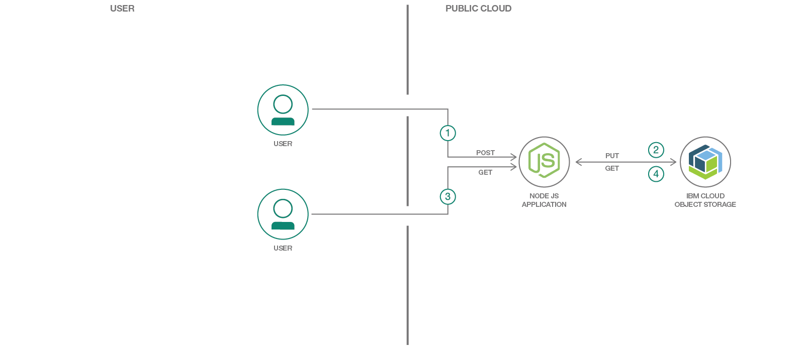
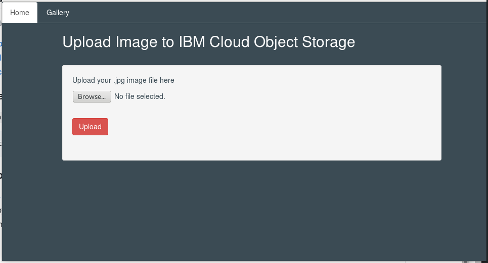

# IBM Cloud Object Storage Web Gallery

In this Code Pattern, we will create a Web Gallery using a Node.js Express web app that stores images to IBM Cloud Object storage, and retrieves their object URL to display them.  At the heart of the server side app is the JavaScript IBM COS SDK package which handles the authentication and connectivity to IBM COS. Express handles the routing allowing the business logic to be handled by the controller. The upload form uploads an image to an express route which calls functions from the IBM COS SDK, multer, and multer-s3 functions to upload it to the designated IBM COS bucket. A request for the image gallery view invokes IBM COS SDK functions to get the URL for each image in the bucket. The URL data is sent back in the response and merged with the EJS view template and during the view rendering.

When the reader has completed this Code Pattern, they will understand how to:

* Deploy a Node.js app (optionally using Cloud Foundry)
* Provision a service instance of Cloud Object Storage
* Use the Node.js IBM COS SDK to interact with Cloud Object Storage



## Flow

1. From the Image Upload form the user selects an image by using the photo gallery upload form and clicks Upload.
2. The form performs a POST to the app, and the app uses the S3 SDK to generate a PUT to the IBM COS server.
3. The user clicks the Gallery tab, which makes a GET request to the app for the gallery view.
4. The app performs a GET request through the S3 SDK to retrieve the image URLs of the images that are stored in the IBM COS bucket. The image URLs passed back in the response are merged with the view template which is rendered for the user and the images are displayed.

## Included components

* [Cloud Foundry](https://www.cloudfoundry.org/): Build, deploy, and run applications on an open source cloud platform.
* [Cloud Object Storage](https://cloud.ibm.com/catalog/services/cloud-object-storage): Build and deliver cost effective apps and services with high reliability and fast speed to market in an unstructured cloud data store.

## Featured technologies

* [Cloud](https://developer.ibm.com/depmodels/cloud/): Accessing computer and information technology resources through the Internet.
* [Node.js](https://nodejs.org/): An open-source JavaScript run-time environment for executing server-side JavaScript code.

# Watch the Video

[](https://www.youtube.com/watch?v=0OLmvFJ_HKM)

# Steps
Use the ``Deploy to IBM Cloud`` button **OR** create run locally

## Deploy to IBM Cloud

[](https://cloud.ibm.com/devops/setup/deploy?repository=https://github.com/IBM/cos-web-gallery)

Press the above ``Deploy to IBM Cloud`` button and then click on ``Deploy``.

## Run the app locally
> NOTE: These steps are only needed when running locally instead of using the ``Deploy to IBM Cloud`` button.

1. [Clone the repo](#1-clone-the-repo)
2. [Configure IBM Cloud Object Storage](#2-configure-ibm-cloud-object-storage)
3. [Run the application](#3-run-the-application)

### 1. Clone the repo

Clone the `cos-web-gallery` locally. In a terminal, run:

```
$ git clone https://github.com/IBM/cos-web-gallery
```

### 2. Configure IBM Cloud Object Storage

In the IBM Cloud Console for COS, select the instance you would like to use, and then `Service Credentials` from the menu on the left.  Create a new credential, and then copy the contents of this credential to the clipboard using the `Copy to Clipboard` icon.  Paste the contents into a file named `~/.bluemix/cos_credentials`.

### 3. Run the application
1. [Install Node.js][] runtime or NPM.
1. Start the app by running `npm install`, followed by `npm start`.
1. Access the running app in a browser at `localhost:3000`

# Sample output

Once run either locally or on IBM Cloud, you should see the following page when you hit the URL for your application:



# License

This code pattern is licensed under the Apache Software License, Version 2. Separate third party code objects invoked within this code pattern are licensed by their respective providers pursuant to their own separate licenses. Contributions are subject to the [Developer Certificate of Origin, Version 1.1 (DCO)](https://developercertificate.org/) and the [Apache Software License, Version 2](https://www.apache.org/licenses/LICENSE-2.0.txt).

[Apache Software License (ASL) FAQ](https://www.apache.org/foundation/license-faq.html#WhatDoesItMEAN)

[Install Node.js]: https://nodejs.org/en/download/
